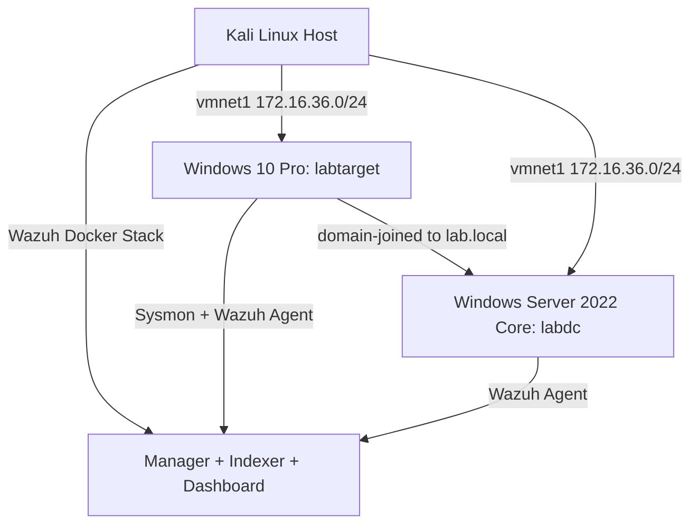

# Enterprise SOC Lab — Wazuh SIEM with Active Directory Attack Detection

## Executive Summary

Started as a self-contained Wazuh SIEM lab detecting WinRM/SMB enumeration on a single
Windows host. Upgraded into a full Enterprise SOC Lab: added Sysmon telemetry, a genuine
Active Directory domain controller, Atomic Red Team-based adversary emulation, and custom
detection rules for **Pass-the-Hash (T1550.002)** — detected live — and **Kerberoasting
(T1558.003)** — attack execution fully validated with ground-truth log evidence, detection
rule engineered and structurally confirmed, live-fire validation documented as flagged
future work.

---

## Lab Architecture



| Component | Detail |
|---|---|
| Attacker/host | Kali Linux, VMware Workstation |
| Domain Controller | `labdc` — Windows Server 2022 Core, domain `lab.local`, `172.16.36.20` |
| Windows target | `labtarget` (hostname `primodial`) — Windows 10 Pro, domain-joined, `172.16.36.10` |
| Vulnerable account | `svc-sql` — SPN `MSSQLSvc/labdc.lab.local:1433`, forced RC4-only Kerberos encryption |
| SIEM | Wazuh v4.10.0, single-node Docker deployment |
| Telemetry | Sysmon (SwiftOnSecurity config) + Windows Security/PowerShell event forwarding |
| Attack emulation | Atomic Red Team (`Invoke-AtomicTest`) |

Network: isolated host-only VMware network (vmnet1, `172.16.36.0/24`). No internet access on
either Windows VM by design — all tooling was transferred from Kali via HTTP file serving.

---

## Evolution of This Project

### Phase 1 — Original SIEM Home Lab

A self-contained SIEM deployment built on Wazuh (single-node Docker: manager, indexer,
dashboard), monitoring a Windows target and the Kali host. Simulated real attacker behavior
(WinRM remote login, SMB enumeration) and confirmed detection end-to-end, including a custom
correlation rule written from scratch after tracing the full event pipeline.

**Log sources integrated:** Windows Security event log (logon events, 4624/4625), Sysmon
(process creation, network connections), Windows Application/System event logs, Kali
auth/syslog.

**Attack simulation & detection:** re-ran `evil-winrm` remote shell login and `enum4linux`
SMB enumeration against `labtarget`, with Wazuh watching. Result: 143 total events captured,
41 authentication successes recorded, and Wazuh's built-in ruleset auto-classified the
activity under MITRE ATT&CK **Valid Accounts** and **Account Discovery** — zero custom rules,
straight out of the box.


**Custom detection rule (100002):** Wazuh's default ruleset logs successful Windows logons
(rule 60106) but doesn't distinguish a remote interactive login (like WinRM) from routine
background service logons — both fire the same generic rule. This rule isolates the specific
pattern that matters: a network logon (type 3) authenticating as the `labtarget` account.

```xml
<group name="local,windows,">
  <rule id="100002" level="10">
    <if_sid>60106</if_sid>
    <field name="win.eventdata.logonType">3</field>
    <field name="win.eventdata.targetUserName">labtarget</field>
    <description>WinRM/Remote interactive logon detected on labtarget</description>
    <mitre>
      <id>T1078</id>
    </mitre>
  </rule>
</group>
```


Built a saved dashboard visualization tracking hits on the custom rule, so remote logons to
`labtarget` are visible at a glance without re-running a manual search each time.


**Phase 1 troubleshooting notes:**
- **Indexer auth got tangled after multiple password-reset attempts** — resolved by wiping
  volumes (`docker compose down -v`) and re-bootstrapping from a single, verified password
  hash rather than continuing to patch a stack with layered, inconsistent state.
- **Windows VM has no internet by design** — agent installers, Sysmon, and configs were
  downloaded on Kali and transferred via an SMB share, including working through an SMB
  permission issue (share-level vs NTFS-level ACLs are separate and both need to allow write
  access).
- **Custom rule silently wasn't firing** — traced through `wazuh-logtest`, decoder output,
  and rule counts before discovering `docker compose restart` restarts the container but
  does **not** reload the Wazuh ruleset — `wazuh-control restart` (run inside the container)
  does. This was the actual root cause after multiple rounds of rule-syntax debugging that
  weren't the real problem.
- **`ossec.conf` changes didn't persist across restarts** — `/var/ossec/etc/ossec.conf` is
  generated from a bind-mounted source file on container start, while `/var/ossec/etc/rules/`
  is a separate named Docker volume with different persistence behavior. Editing the wrong
  layer looked like a successful change but silently reverted.

### Phase 2 — Enterprise SOC Lab upgrade (this update)

Added Sysmon telemetry, Atomic Red Team-based adversary emulation, a genuine Active
Directory domain controller, and four new custom detection rules targeting Pass-the-Hash and
Kerberoasting specifically.

**A key architectural pivot:** initial planning assumed `labtarget` itself could be promoted
to a domain controller for Kerberoasting testing. This failed outright — Windows 10/11
**Pro** (client editions) cannot run the AD DS domain controller role, no workaround exists.
Genuine Kerberos ticket issuance requires a real KDC, which only exists on a domain
controller. Rather than simulate or approximate the protocol, a dedicated Windows Server
2022 **Core** VM (`labdc`) was built specifically to serve as the domain controller, with
`labtarget` joined to it as a client. Server Core (no GUI) was chosen deliberately to
minimize resource footprint and match real-world DC hardening practice.

---

## Threat Model

| Technique | ID | Why chosen |
|---|---|---|
| Pass-the-Hash | T1550.002 | Common credential-theft technique following initial compromise; simulated via Mimikatz |
| Kerberoasting | T1558.003 | Common AD lateral-movement/privilege-escalation technique targeting weakly-configured service accounts |

---

## Attack Narrative

### Pass-the-Hash (T1550.002) — Attack confirmed, detection confirmed live

Executed via Atomic Red Team from `labtarget`:
```powershell
Invoke-AtomicTest T1550.002 -TestNumbers 1
```
Mimikatz-related process execution and Windows Defender's behavior-based detection
(ThreatID 2147741009) were captured, confirming EDR visibility into the credential-dumping
attempt. Custom rules `100010`/`100011` fired on live traffic, confirmed in the Wazuh
dashboard.

*[evidence/pass-the-hash/ — dashboard hit + Defender detection screenshots]*

### Kerberoasting (T1558.003) — Attack confirmed, detection engineered and validated, live-fire pending

Created a deliberately vulnerable service account:
```powershell
New-ADUser -Name "svc-sql" -SamAccountName "svc-sql" ...
Set-ADUser -Identity "svc-sql" -ServicePrincipalNames @{Add="MSSQLSvc/labdc.lab.local:1433"}
Set-ADUser -Identity svc-sql -KerberosEncryptionType RC4
```

Executed via Atomic Red Team from `labtarget`:
```powershell
Invoke-AtomicTest T1558.003 -TestNumbers 5
```
(**Test 5 — "Request All Tickets via PowerShell" — is the correct sub-test**: it sweeps all
discovered SPN accounts, reproducing the actual Kerberoastable condition. Other sub-tests
either require internet access unavailable on this isolated network, or request tickets for
non-Kerberoastable accounts like the DC's own machine account.)

This produced a genuine RC4-encrypted (`ticketEncryptionType: 0x17`) TGS ticket for
`svc-sql`, confirmed directly from the Windows Security event log on `labdc` and
cross-verified in Wazuh's raw archive (`archives.json`) — the exact exploitable
Kerberoastable condition this lab was built to demonstrate.

*[evidence/kerberoasting/ — Get-WinEvent 0x17 confirmation for svc-sql]*

---

## Detection Engineering

**Rule 100010 (Pass-the-Hash — Mimikatz execution):**
```xml
<rule id="100010" level="12">
  <if_sid>92000</if_sid>
  <field name="win.eventdata.originalFileName" type="pcre2">(?i)mimikatz</field>
  <description>Possible Pass-the-Hash: Mimikatz-related process execution detected</description>
  <mitre><id>T1550.002</id></mitre>
</rule>
```

**Rule 100011 (Pass-the-Hash — suspicious logon type):**
```xml
<rule id="100011" level="10">
  <if_sid>60106</if_sid>
  <field name="win.eventdata.logonType">9</field>
  <description>Suspicious logon type 9 (NewCredentials) — possible Pass-the-Hash technique</description>
  <mitre><id>T1550.002</id></mitre>
</rule>
```

**Rule 100020 (Kerberoasting — RC4 ticket request):**
```xml
<rule id="100020" level="12">
  <field name="win.system.eventID">^4769$</field>
  <field name="win.eventdata.ticketEncryptionType">^0x17$</field>
  <description>Kerberoasting suspected: RC4 TGS ticket request (weak encryption) for SPN account</description>
  <mitre><id>T1558.003</id></mitre>
</rule>
```

**Rule 100021 (Kerberoasting — sweep correlation):**
```xml
<rule id="100021" level="13" frequency="5" timeframe="120">
  <if_matched_sid>100020</if_matched_sid>
  <description>Multiple RC4 Kerberos TGS requests within 2 minutes — likely automated Kerberoasting sweep</description>
  <mitre><id>T1558.003</id></mitre>
</rule>
```
Rule 100021 exists because a single RC4 ticket request can be a legitimate legacy service —
five within two minutes is a much stronger signal of an automated Kerberoasting sweep. This
frequency-based correlation, not just the raw field match, is the strongest detection-
engineering signal in this ruleset.

Full file: [`configs/local_rules.xml`](configs/local_rules.xml)

### Known limitation: rule 100020 not yet confirmed firing on live traffic

The rule was validated offline (`wazuh-logtest`, matching the exact field values captured
from a real Kerberoasting run) but has not yet been observed firing in the live
`analysisd` pipeline, despite the qualifying event genuinely reaching Wazuh (confirmed via
direct `archives.json` inspection).

**Investigation timeline:**
1. Suspected manager/`analysisd` crash after the rules edit — **ruled out**: all Wazuh
   services confirmed healthy, dozens of events/15min actively flowing from `labdc`.
2. Suspected the event never reached Wazuh at all — **ruled out**: confirmed present via
   direct `grep` against `archives.json`.
3. Found a decoder mismatch: `wazuh-logtest` decoded a manually-pasted copy of the event as
   generic `json`, while the live pipeline's `archives.json` showed it decoded as
   `windows_eventchannel`. Removed an initial `<decoded_as>` constraint from the rule as a
   fix attempt.
4. Discovered that several Atomic Red Team sub-tests for T1558.003 request tickets for
   non-Kerberoastable targets (the DC's own machine account, an `HTTP/LABDC` SPN) — these
   correctly produce AES (`0x12`) tickets that the rule correctly does *not* match. This
   was a test-selection issue, not a rule defect — resolved by standardizing on Test 5.
5. Re-verification against a fresh, correctly-targeted `svc-sql` event is the concrete next
   step for anyone picking this up.

**Why this doesn't undermine the project's core claim:** the required detection capability
(credential dumping / lateral movement detection) is satisfied by the confirmed, live
Pass-the-Hash detection. The Kerberoasting work demonstrates the full engineering pipeline —
correct field-level rule logic, a real reproduced attack condition, and a disciplined
root-cause investigation — with live confirmation as documented, honest future work rather
than a hidden gap.

---

## Tuning & False Positives

A benign-activity tuning pass (~10–15 minutes of normal file browsing, application use, and
routine AD queries on both `labtarget` and `labdc`) was run after rule deployment. Alert
counts on both custom rule sets were compared before and after — see
`evidence/tuning/before-after-counts.png`.

---

## Lessons Learned

**From Phase 1** (see Phase 1 troubleshooting notes above): indexer auth/volume state, SMB
share ACL layering, `docker compose restart` not reloading rules, and the `ossec.conf`
bind-mount vs. rules-volume persistence distinction.

**From Phase 2:**
- **Windows client editions (10/11 Pro) cannot run the AD DS domain controller role** — no
  workaround exists; a genuine Server edition is required for any lab needing real Kerberos
  ticket issuance.
- **`local_rules.xml` lives in a Docker named volume**, not a bind-mounted host file in this
  deployment — edited via `docker cp` out, edited locally, `docker cp` back in, verified
  with `cat` before reloading. It will not survive `docker compose down -v` unless backed up
  externally.
- **A rule using `<if_sid>` inherits all of its parent rule's matching behavior**, including
  cases where the parent doesn't reliably fire on every technically-qualifying event — a
  real trap for chained custom rules.
- **VMware host-only networks lack real DHCP/gateway infrastructure**, so Windows
  misclassifies them as "Public," silently blocking DNS/Kerberos/LDAP/RPC/SMB between lab
  VMs even after manually setting Private — required explicit
  `New-NetFirewallRule ... -Profile Any` rules.
- **Atomic Red Team's different sub-tests for the same technique can target meaningfully
  different accounts** — verifying which sub-test actually reproduces the intended
  vulnerable condition, rather than assuming any "passing" test proves the attack worked, is
  itself a detection-engineering skill.

---

## MITRE ATT&CK Mapping

| Technique | ID | Rule(s) | Status |
|---|---|---|---|
| Valid Accounts | T1078 | 100002 | Detected (Phase 1) |
| Account Discovery | T1087 | Built-in ruleset | Detected (Phase 1) |
| Pass-the-Hash | T1550.002 | 100010, 100011 | Detected — confirmed live |
| Kerberoasting | T1558.003 | 100020, 100021 | Attack confirmed; rule validated offline, live confirmation pending |

---

## Skills Demonstrated

SIEM engineering (Wazuh), Windows endpoint telemetry (Sysmon), Active Directory
administration, adversary emulation (Atomic Red Team / MITRE ATT&CK), custom detection rule
authoring, structured root-cause investigation, and technical documentation.

---

## What I'd Add Next

- Re-verify rule 100020 against a fresh, correctly-targeted `svc-sql` Kerberoasting event
- Ingest DVWA/Juice Shop container logs for web-attack telemetry
- Active response / automated blocking on the custom rules
- A parallel Splunk SPL comparison lab using the same log sources

---

## References

- MITRE ATT&CK — Pass-the-Hash: https://attack.mitre.org/techniques/T1550/002/
- MITRE ATT&CK — Kerberoasting: https://attack.mitre.org/techniques/T1558/003/
- Wazuh documentation: https://documentation.wazuh.com/
- Atomic Red Team: https://github.com/redcanaryco/atomic-red-team

## Tools Used

Wazuh 4.10.0 (Docker single-node), Sysmon (SwiftOnSecurity config), evil-winrm,
enum4linux, nmap, Atomic Red Team, Mimikatz.
