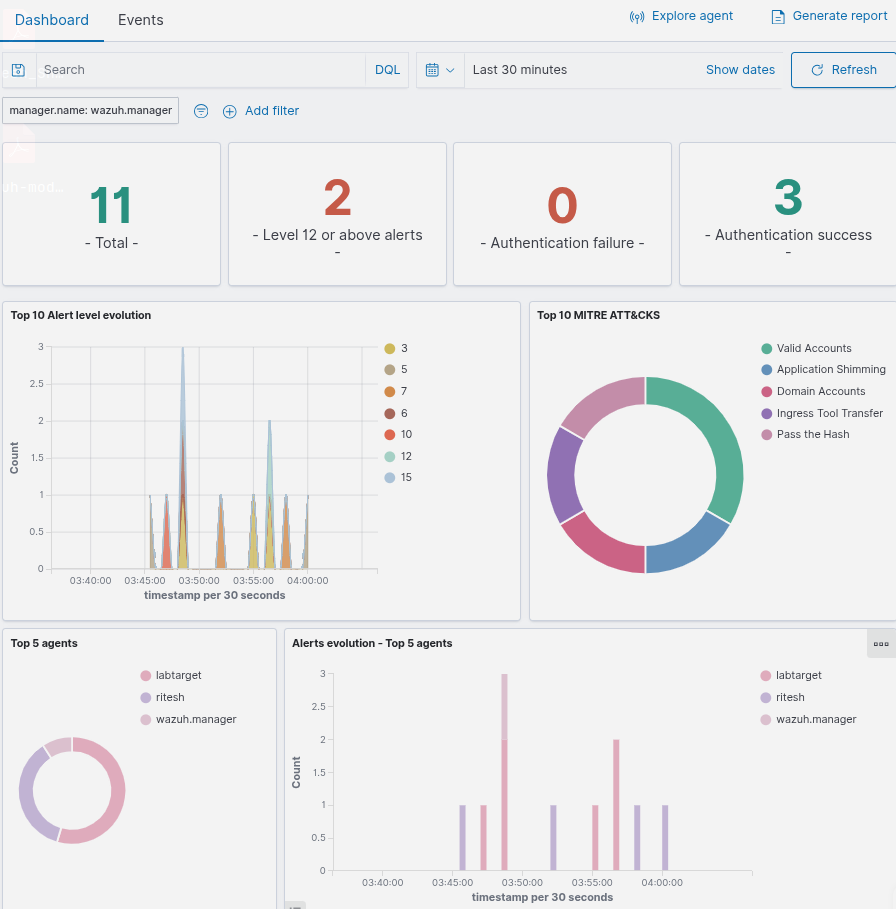
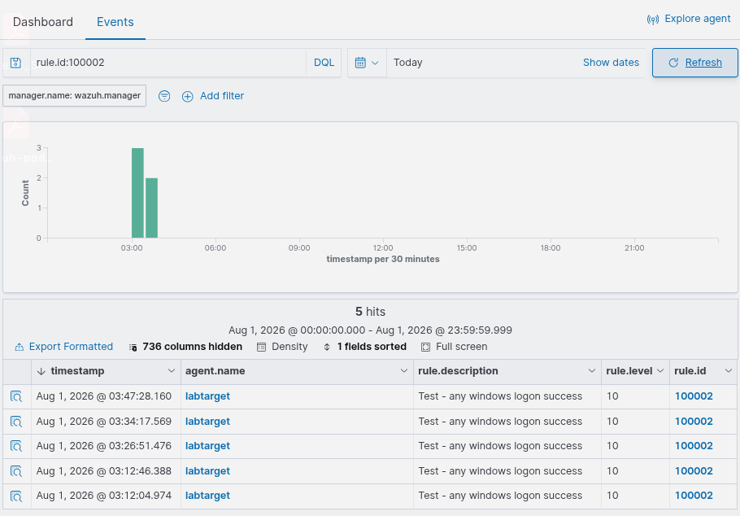
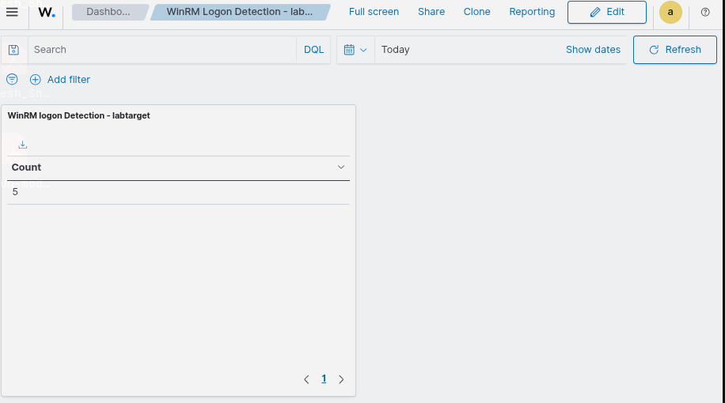
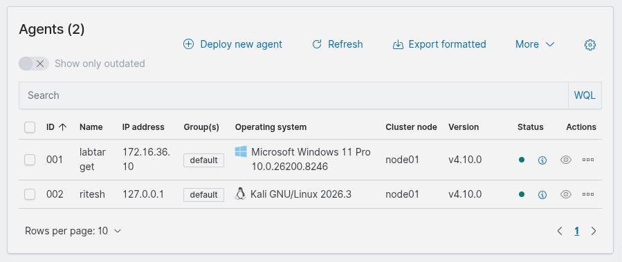

# SIEM Home Lab — Wazuh

## Overview
A self-contained SIEM deployment built on Wazuh (single-node Docker: manager, indexer, dashboard),
monitoring a Windows 10/11 VM target and a Kali Linux host. Simulated real attacker behavior
(WinRM remote login, SMB enumeration) and confirmed detection end-to-end, including a custom
correlation rule written from scratch after tracing the full event pipeline.

## Architecture
Kali Linux (host) → Wazuh Docker stack (manager + indexer + dashboard)
                  → Wazuh agent on Windows VM (labtarget) — Sysmon + Security event log forwarding
                  → Wazuh agent on Kali host — auth/syslog forwarding

Network: isolated host-only VMware network (vmnet1, 172.16.36.0/24). No internet access on the
Windows VM by design — agent installers and tooling were transferred via an authenticated SMB share.

[Add a simple box diagram here — Excalidraw or draw.io export as PNG]

## Log Sources Integrated
- Windows Security event log (logon events, 4624/4625)
- Sysmon (process creation, network connections) via SwiftOnSecurity config
- Windows Application/System event logs
- Kali auth/syslog (second agent)

## Attack Simulation & Detection
Re-ran the attacks from my earlier Cybersecurity Home Lab project against the same target,
this time with Wazuh watching:
- `evil-winrm` remote shell login (labtarget)
- `enum4linux` SMB enumeration

Result: 143 total events captured, 41 authentication successes recorded, and Wazuh's built-in
ruleset auto-classified the activity under the MITRE ATT&CK techniques **Valid Accounts** and
**Account Discovery** — with zero custom rules, straight out of the box.



## Custom Detection Rule
Wazuh's default ruleset logs successful Windows logons (rule 60106) but doesn't distinguish a
remote interactive login (like WinRM) from routine background service logons — both fire the
same generic rule. I wrote a custom rule to isolate the specific pattern that matters for this
target: a network logon (type 3) authenticating as the `labtarget` account.

```xml
<group name="local,windows,">
  <rule id="100002" level="10">
    <if_sid>60106</if_sid>
    <field name="win.eventdata.logonType">3</field>
    <field name="win.eventdata.targetUserName">labtarget</field>
    <description>WinRM/Remote interactive logon detected on labtarget</description>
    <mitre>
      <id>T1078</id>
    </mitre>
  </rule>
</group>
```

Full file: [`configs/local_rules.xml`](configs/local_rules.xml)



## Dashboard
Built a saved visualization tracking hits on the custom rule, so remote logons to `labtarget`
are visible at a glance without re-running a manual search each time.



## Agents


## Troubleshooting Notes (real issues hit during the build)
- **Indexer auth got tangled after multiple password-reset attempts** — resolved by wiping
  volumes (`docker compose down -v`) and re-bootstrapping from a single, verified password hash
  rather than continuing to patch a stack with layered, inconsistent state.
- **Windows VM has no internet by design (isolated lab network)** — agent installers, Sysmon,
  and configs were downloaded on Kali and transferred via an SMB share (`C:\Shared`), including
  working through an SMB permission issue (share-level vs NTFS-level ACLs are separate and both
  need to allow write access).
- **Custom rule silently wasn't firing** — traced through `wazuh-logtest`, decoder output, and
  rule counts before discovering `docker compose restart` restarts the container but does **not**
  reload the Wazuh ruleset — `wazuh-control restart` (run inside the container) does. This was the
  actual root cause after multiple rounds of rule-syntax debugging that weren't the real problem.
- **`ossec.conf` changes didn't persist across restarts** — turned out `/var/ossec/etc/ossec.conf`
  is generated from a bind-mounted source file (`config/wazuh_cluster/wazuh_manager.conf`) on
  container start, while `/var/ossec/etc/rules/` is a separate named Docker volume with different
  persistence behavior. Editing the wrong layer looked like a successful change but silently reverted.

## Tools Used
Wazuh 4.10.0 (Docker single-node), Sysmon (SwiftOnSecurity config), evil-winrm, enum4linux, nmap

## What I'd Add Next
- Ingest DVWA/Juice Shop container logs for web-attack telemetry
- Splunk SPL comparison lab using the same log sources
- Active response / automated blocking on rule 100002
